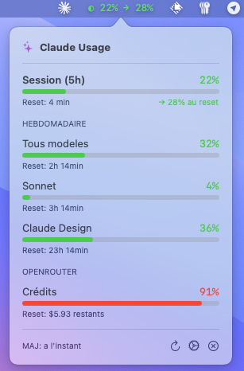
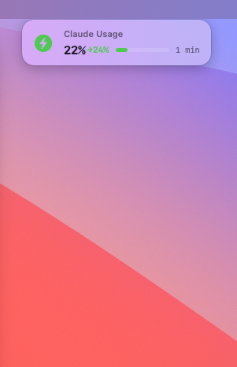

# Claude Usage Bar

A lightweight macOS menu bar app to monitor your Claude Max subscription usage in real-time.


## Features

- **Menu bar indicator** showing current session usage percentage, plus a forward-looking projection at reset (e.g. `◐ 67% → 89%`)
- **Burn-rate projection** on every bucket — linear projection of where utilization will land at the next reset, expressed in the same `%` unit Anthropic uses. Color-coded green / orange / red by projected value so you see at a glance whether you'll hit the limit before reset.
- **Detailed popover** with all usage metrics:
  - Session (5h) usage with reset countdown and projection
  - Weekly limits for all models (with projection when consumption is active)
  - Sonnet-only usage (with projection)
  - Claude Design usage (with projection)
  - **OpenRouter credits** (optional) — remaining balance + utilization bar
- **Notch overlay** — hover the top of the screen to reveal a floating pill showing session %, projection, color-coded progress bar, and reset countdown. Sits right under the Mac notch (works on non-notched Macs too). Opt-in from Settings.
- **Auto-refresh** every 5 minutes
- **Secure storage** of credentials in macOS Keychain
- **Launch at startup** support via LaunchAgent

## Requirements

- macOS 12.0+ (Monterey or later)
- A Claude Max subscription
- *(Optional)* An [OpenRouter](https://openrouter.ai) account with an API key
- Xcode Command Line Tools (for building)

## Installation

### Option 1: Build from source

```bash
git clone https://github.com/LouisMasson/ClaudeUsageBar.git
cd ClaudeUsageBar
swift build -c release
```

The executable will be at `.build/release/ClaudeUsageBar`

### Option 2: Open in Xcode

```bash
cd ClaudeUsageBar
open Package.swift
```

Then press `Cmd+R` to build and run.

## Configuration

On first launch, a configuration window will appear. You need to provide:

### 1. Organization ID

1. Go to [claude.ai/settings/usage](https://claude.ai/settings/usage)
2. Open DevTools (`Cmd+Option+I`)
3. Go to **Network** tab, filter by **XHR/Fetch**
4. Refresh the page
5. Look for a request to `/api/organizations/.../usage`
6. Copy the UUID from the URL (e.g., `xxxxxxxx-xxxx-xxxx-xxxx-xxxxxxxxxxxx`)

### 2. Session Cookie

1. In the same request, go to **Headers** tab
2. Find **Request Headers** > **Cookie**
3. Copy only the `sessionKey=sk-ant-sid01-...` part

### 3. OpenRouter API Key *(optional)*

If you also use [OpenRouter](https://openrouter.ai) to access other models, the app
can display your remaining credits alongside Claude usage.

1. Go to [openrouter.ai/keys](https://openrouter.ai/keys)
2. Create a new API key (read-only is fine — the app only calls `GET /api/v1/credits`)
3. Copy the `sk-or-v1-...` value into the **"OpenRouter API Key"** field in settings

Leave this field empty to hide the OpenRouter section entirely. Clearing it and
saving also removes the key from your Keychain.

## Usage

- **Click** on the menu bar icon to see detailed usage
- **Refresh button** to manually update data
- **Gear icon** to open settings
- **X icon** to quit the app

## Burn-rate projection



Every bucket (Session 5h, Weekly all models, Sonnet, Claude Design) tracks a rolling window of samples and projects where utilization will land at its own reset. Same unit as Anthropic's API — percent — so nothing new to learn.

**What you see:**
- Menu bar: `◐ 67% → 89%` where `89%` is the projected value at reset
- Popover: each row shows `→ N% au reset` under the reset timer
- Notch pill: `67% →89%` inline

**Color scale (driven by the projection, not the current value):**
- Green: projected < 60%
- Orange: projected 60–85%
- Red: projected ≥ 85% (you will hit the limit before reset)

**When it appears:** the projection shows only when there are at least 2 samples and a positive slope. If utilization is flat (you're not consuming), no projection is rendered — rather than showing noise. The session bucket usually gets its first projection after ~10 minutes of active use. Weekly buckets only show a projection when consumption is meaningful on the sampled window.

**Mechanism:** per-bucket rolling sample buffer (up to 12 points), linear slope, projection to the bucket's `resetsAt`. Samples older than the bucket's reset window are purged automatically, so history never spans a missed reset (Mac sleep, app restart, etc.).

Implementation: `BurnRateProjection.swift`. Self-contained, `@MainActor`, no external dependencies.

## Notch overlay



A floating pill can appear under the Mac notch when the cursor enters a hot zone at the top of the screen — showing session %, the burn-rate projection, a color-coded progress bar, and the reset countdown without having to click the menu bar icon.

1. Open **Settings** (gear icon in the popover)
2. Toggle **"Overlay sous l'encoche"** on, save
3. Move the cursor near the notch — the pill fades in; move away, it fades out

Implementation: a non-activating `NSPanel` positioned under `safeAreaInsets.top`, driven by a global mouse monitor. Doesn't steal focus. Disabled by default, persisted in `UserDefaults`. Also works on Macs without a notch (hot zone = top-center of the main screen).

## Launch at Startup

The app includes a LaunchAgent for automatic startup. To enable:

```bash
cp ~/Library/LaunchAgents/com.louismasson.ClaudeUsageBar.plist ~/Library/LaunchAgents/
launchctl load ~/Library/LaunchAgents/com.louismasson.ClaudeUsageBar.plist
```

## Project Structure

```
ClaudeUsageBar/
├── Package.swift              # Swift Package Manager config
├── README.md
├── claude-usage               # Helper script to start/stop
└── ClaudeUsageBar/
    ├── Info.plist
    └── Sources/
        ├── ClaudeUsageBarApp.swift       # App entry point
        ├── StatusBarController.swift      # Menu bar controller
        ├── PopoverView.swift              # SwiftUI views
        ├── UsageData.swift                # Data models
        ├── ClaudeAPIService.swift         # claude.ai API client
        ├── OpenRouterAPIService.swift     # OpenRouter API client
        ├── KeychainHelper.swift           # Secure storage
        ├── BurnRateProjection.swift       # Per-bucket burn-rate tracker + linear projection
        ├── NotchOverlayController.swift   # Notch hover overlay (panel + mouse monitor)
        └── NotchOverlayView.swift         # SwiftUI pill rendered in the overlay
```

## Privacy & Security

- Credentials (Claude session cookie, OpenRouter API key) are stored securely in macOS Keychain
- No data is sent to third parties
- The app only communicates with `claude.ai` and, if configured, `openrouter.ai`
- Session cookies expire after ~30 days and need to be refreshed
- The OpenRouter key is only used to call `GET /api/v1/credits` (read-only balance lookup)

## License

MIT License - Feel free to use and modify.

---

Built with Swift and SwiftUI.
