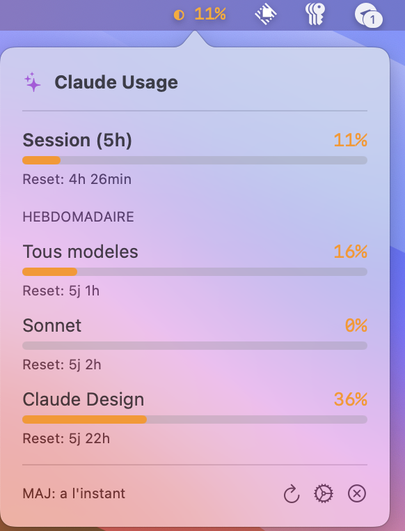

# Claude Usage Bar

A lightweight macOS menu bar app to monitor your Claude Max subscription usage in real-time.



## Features

- **Menu bar indicator** showing current session usage percentage
- **Detailed popover** with all usage metrics:
  - Session (5h) usage with reset countdown
  - Weekly limits for all models
  - Sonnet-only usage
  - Claude Design usage
- **Auto-refresh** every 5 minutes
- **Secure storage** of credentials in macOS Keychain
- **Launch at startup** support via LaunchAgent

## Requirements

- macOS 12.0+ (Monterey or later)
- A Claude Max subscription
- Xcode Command Line Tools (for building)

## Installation

### Option 1: Build from source

```bash
git clone https://github.com/LouisMasson/ClaudeUsageBar.git
cd ClaudeUsageBar
swift build -c release
```

The executable will be at `.build/release/ClaudeUsageBar`

### Option 2: Open in Xcode

```bash
cd ClaudeUsageBar
open Package.swift
```

Then press `Cmd+R` to build and run.

## Configuration

On first launch, a configuration window will appear. You need to provide:

### 1. Organization ID

1. Go to [claude.ai/settings/usage](https://claude.ai/settings/usage)
2. Open DevTools (`Cmd+Option+I`)
3. Go to **Network** tab, filter by **XHR/Fetch**
4. Refresh the page
5. Look for a request to `/api/organizations/.../usage`
6. Copy the UUID from the URL (e.g., `xxxxxxxx-xxxx-xxxx-xxxx-xxxxxxxxxxxx`)

### 2. Session Cookie

1. In the same request, go to **Headers** tab
2. Find **Request Headers** > **Cookie**
3. Copy only the `sessionKey=sk-ant-sid01-...` part

## Usage

- **Click** on the menu bar icon to see detailed usage
- **Refresh button** to manually update data
- **Gear icon** to open settings
- **X icon** to quit the app

## Launch at Startup

The app includes a LaunchAgent for automatic startup. To enable:

```bash
cp ~/Library/LaunchAgents/com.louismasson.ClaudeUsageBar.plist ~/Library/LaunchAgents/
launchctl load ~/Library/LaunchAgents/com.louismasson.ClaudeUsageBar.plist
```

## Project Structure

```
ClaudeUsageBar/
├── Package.swift              # Swift Package Manager config
├── README.md
├── claude-usage               # Helper script to start/stop
└── ClaudeUsageBar/
    ├── Info.plist
    └── Sources/
        ├── ClaudeUsageBarApp.swift    # App entry point
        ├── StatusBarController.swift   # Menu bar controller
        ├── PopoverView.swift           # SwiftUI views
        ├── UsageData.swift             # Data models
        ├── ClaudeAPIService.swift      # API client
        └── KeychainHelper.swift        # Secure storage
```

## Privacy & Security

- Credentials are stored securely in macOS Keychain
- No data is sent to third parties
- The app only communicates with `claude.ai`
- Session cookies expire after ~30 days and need to be refreshed

## License

MIT License - Feel free to use and modify.

---

Built with Swift and SwiftUI.
